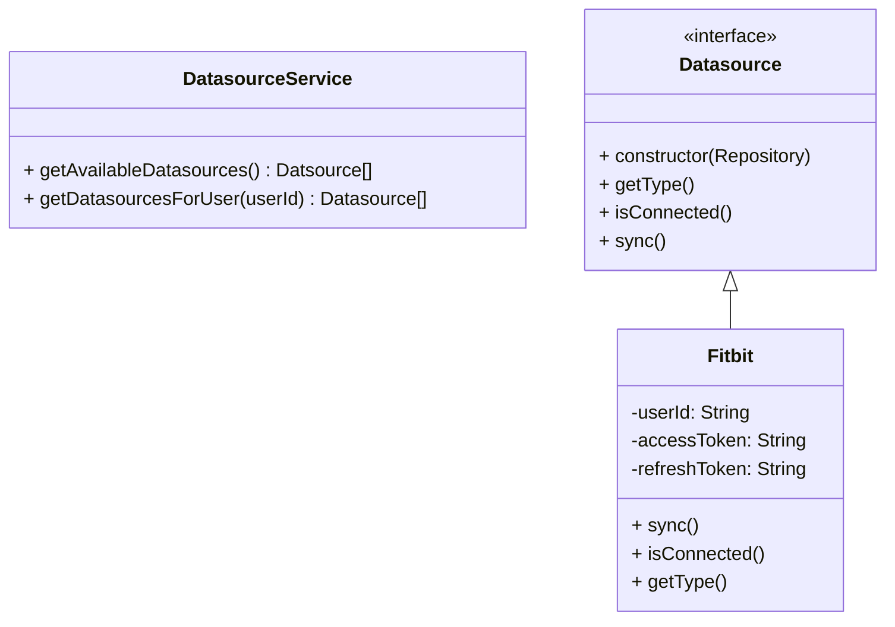
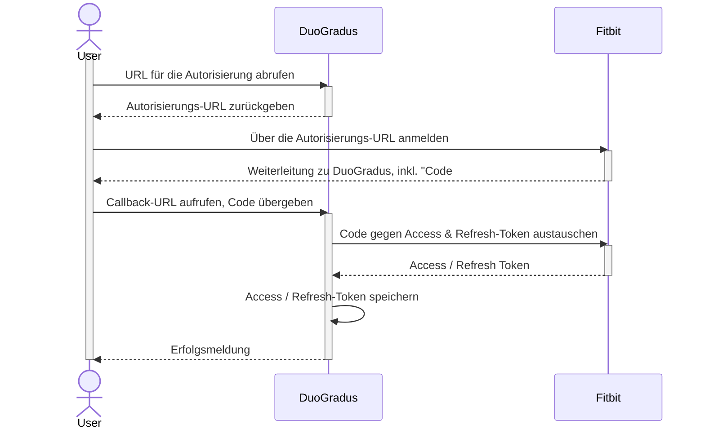

# Fitness Datenquellen

Für die Funktionalität der Anwendung werden externe Datenquellen genutzt. Diese Datenquellen enthalten für die Funktionalität wichtige Daten, wie z.B. die Anzahl an Schritten die eine Person am Tag gelaufen ist. Damit die Daten eines Nutzers gesammelt werden können muss der Nutzer eine Datenquelle mit seinem Konto verbinden. In der initialen Version wird es möglich sein eine einzige Datenquelle zu verbinden: **Fitbit**.

## Integration

Die Verwaltung der Fitness-Anbieter erfolgt über die Rest-Schnittstelle (`/datasource`). Dort kann die Verbindung zu einem Anbieter eingerichtet werden, als auch wieder entfernt werden. Die Schnittstelle ist auf Anbieter ausgelegt, die das OAuth2 Protokoll unterstützen.

Die unterstützen Anbieter sind hardcodiert. Alle Anbieter implementieren das Interface "Datasource".

Über den **DatasourceService** können Datenquellen sowohl global als auch im Kontext eines Nutzers geladen werden. Falls die Datenquellen im Kontext eines Nutzers geladen werden.
Die Autorisierung erfolgt über die einzelnen Datenquellen.

## Fitbit Integratation

### Autorisierung

Die Autorisierung folgt dem OAuth2 Authorization Code Verfahren. Dieses Verfahren erfordert ein aktives Eingreifen des Benutzers. Die Autorisierung sieht folgendermaßen aus:

Der Anbieter (wie z.B. Fitbit) gibt bei diesem Verfahren einen Access Token an, der jedoch nur kurze Zeit gültig ist. Mithilfe des Refresh-Tokens kann ein neuer Access Token generiert werden. Üblicherweise wird dabei auch ein neuer Refresh-Token generiert. Der alte bleibt jedoch für einen weiteren Zeitraum gültig.

**Weiterführende Informationen**:

- <a href="https://auth0.com/docs/authenticate/protocols/oauth">Auth0 OAuth2 Dokumentation</a>
- <a href="https://learn.microsoft.com/de-de/entra/identity-platform/v2-oauth2-auth-code-flow">Microsoft OAuth2</a>
- <a href="https://dev.fitbit.com/build/reference/web-api/developer-guide/authorization/">Fitbit OAuth2 Dokumentation</a>
