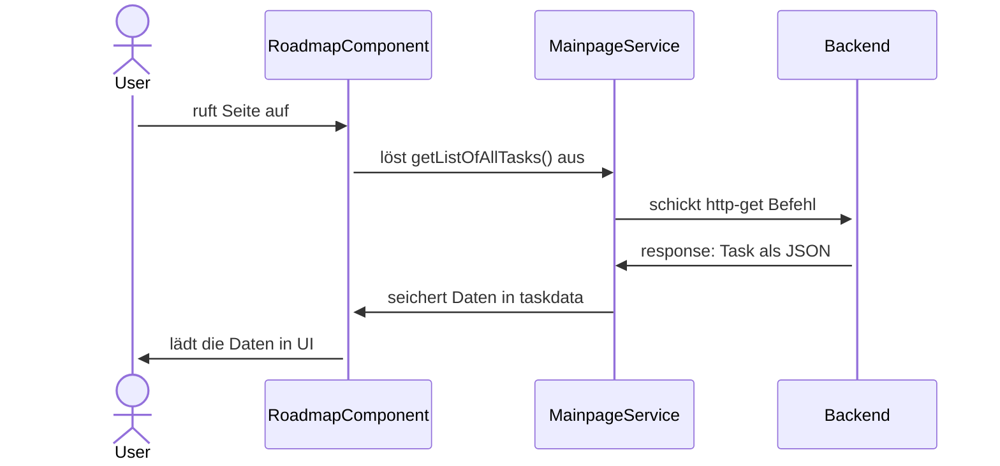

# Technical documentation

|                      |                            |
| -------------------- | -------------------------- |
| **Sprache**          | **Typescript, HTML, SCSS** |
| **Framework**        | **Angular**                |
| **Version**          | **17.0.8.**                |
| **Packetverwaltung** | **npm**                    |

### Frontend Struktur

---

Die Struktur des Frontends entspricht der typischen Angular Anwendung (siehe [Doku](https://v17.angular.io/guide/file-structure))

Übersicht Verzeichnis Frontend:

```
frontend
└── src
    ├── app
    |   |
    │   ├── components                  - Komponenten der Seite
    │   │   ├── atoms
    │   │   ├── organisms
	|   |   └── pages
    │   │
    │   ├── pipes
    │   │   ├── timer
    │   │   ├── user-filter
    │   │   └── ...
	|   |
    │   ├── services
    │   │   ├── event.service.ts
    │   │   ├── loader.service.ts
    │   │   └── ...
    |   |-- styles                     - Globale Design Regeln
	|   |
    │   ├── app.component.ts
    │   ├── app.module.ts
    │   ├── app-routing.ts             - Routing Konfiguration
    │   ├── authenticated.guard.ts     - AuthGuard
    │   └── route-transition-animation.ts   - Animationsregeln
    └── assets                         - Statische Assets

```

Zusätlich befindet sich zu jeder Datei eine Testdatei.

### EventService

---

Der EventService wird verwendet, um Daten zwischen den Komponenten auszutauschen. Dazu müssen die Komponenten den EventService importieren und ihn im Konstruktor einbinden.

```ts
import { EventService } from 'app/services/event.service';

[...]

 constructor(public eventService: EventService) {
    this.eventService = eventService;
  }
```

### LoaderService

---

Um den Loader ein- und ausblenden zu können, wurde ein LoaderService implementiert. Dieser stellt für beide Aufgaben jeweils eine Methode bereit, die beim abrufen der Daten aufgerufen werden können.

#### Anwendungsbeispiel:

---

`loader.service.ts

```ts
 public isLoading = new BehaviorSubject<boolean>(false);
  constructor() {}
  show() {
    this.isLoading.next(true);
  }
  hide() {
    this.isLoading.next(false);
  }
```

`mainpage.component.ts`

```ts
constructor(private LoaderService: LoaderService) { }
  ngOnInit(): void {
    this.LoaderService.show();
    //Simulate a html request
    setTimeout(() => {
      this.LoaderService.hide();
    }, 500);

  }
```

`app.component.ts`

```ts
...
<app-loader *ngIf="isLoading" ></app-loader>
...
```

### Backend Kommunikation

---

Die Kommunikation mit dem Backend erfolgt über eine REST-API. Eine Service-Klasse sendet HTTP-Anfragen an das Backend, und die eingehenden Daten werden von den Komponenten genutzt. Der Service wird im Konstruktor der Komponenten aufgerufen.

#### Bsp:

Das folgende Diagramm veranschaulicht die Kommunikation, die zur Abfrage der "Tasks" vom Backend zuständig ist:


