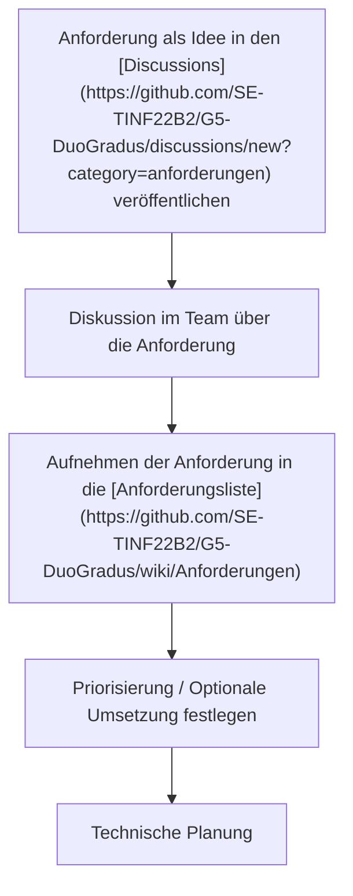

# Anforderungen

Auf dieser Seite werden die Anforderungen an die Anwendung festgehalten. Diese Liste enthält dabei die Anforderungen **aus Anwendersicht** (in besonderen Fällen, gesondert gekennzeichnet noch eine Technische Notiz, die allerdings kein Teil der Anforderungen ist).

Anforderungen durchlaufen einen Prozess:

Der Aktuelle Status der Anforderungen wird [hier](https://github.com/orgs/SE-TINF22B2/projects/19/views/1) festgehalten.

## Integration mit Drittanbietern zur Datenerhebung [PM-1]

Das Produkt soll Schritt- und eventuell Aktivitätsdaten von externen Anbietern erfassen. Diese Anforderung ergibt sich aus der Grundfunktionalität der Anwendung, sowie der Anforderung des Auftraggebers.
Folgende Anbieter werden für die Implementierung herangezogen:

- Fitbit
- Google Health
- Samsung Fit

Mindestens erforderlich ist die Integration eines einzigen Anbieters, aufgrund der vergleichsweise simplen Schnittstelle wird Fitbit für eine erste Implementierung empfohlen.

### Technische Betrachtung (Notiz)

Für die Integration mit Drittanbietern ist es notwendig, dass diese eine Schnittstelle anbieten, auf die wir zugreifen können. Wir möchten für diese Anwendung nur offizielle Schnittstellen verwenden. Da wir keine Anwendung auf den Endgeräten planen müssen wir uns auf Web-APIs beschränken.

FitBit bietet eine Rest-API an, die sich für diesen Zweck eignen könnte. Für die Nutzung dieser ist lediglich ein FitBit-Account notwendig.

Die Daten müssen durch das Backend von der API abgerufen werden, dafür ist bei den meisten APIs eine Zustimmung des Nutzers über das OAuth2-Verfahren notwendig. Der Nutzer muss die Anwendung einmalig berechtigen und kann dabei auch Berechtigungen festlegen.

## Aufgaben, Ziele und Abzeichen [PM-2]

Kernfunktionalität der Anwendung sind "Ziele", die der Benutzer durch seine Aktivitäten erreichen kann. Die Art der Ziele ist dabei abhängig von den implementierten Integrationen. Mindestens verfügbar sein sollen Schrittziele, bei denen folgende Parameter erforderlich sind:

- Anzahl von Schritten
- Startzeit
- Endzeit
- Punkte
- Dauer (beispielsweise: "100 Schritte innerhalb von 4 Minuten erreichen.")

Zudem sollen Ziele sinnvolle Namen erhalten.

Weitere optionale Felder sind:

- Wetter

Falls möglich, sollen neben Schrittzielen zusätzlich Aktivitätsziele definiert werden.

Für bestimmte Aktivitäten soll ein Nutzer zudem Abzeichen / Erfolge sammeln können. Denkbar wäre hier beispielsweise ein Abzeichen "Nicht aus Zucker" für eine Aktivität im Regen.

## Tageszielpunkte [PM-3]

Damit der Nutzer die App regelmäßig verwendet soll der Nutzer für jeden Tag an dem er die App verwendet einen Punkt erhalten. Nutzt er die App an einem Tag nicht (bzw. erfüllt seine Mindest-Anzahl an Schritten nicht) werden die Punkte auf 0 zurückgesetzt.

Gegen Abend soll der Nutzer eine Benachrichtigung erhalten, falls er bisher noch keinen Punkt erreicht hat. Diese soll den Nutzer passiv-aggressiv an seine Schritte erinnern (siehe [PM-5])

Optional: Nachrichten mithilfe generativer AI erstellen.

Benachrichtigungen z.B. über E-Mail

## Rangliste [PM-4]

Die Anwendung bietet Nutzern die Möglichkeit sich in einer Rangliste zu vergleichen. Dabei gibt es eine globale Rangliste und eine private Rangliste, in der sich Nutzer mit Freunden vergleichen können. Die Platzierung in der Rangliste wird über die Punkte des Spielers entschieden.

Für die private Rangliste müssen Nutzer Freundschaftsanfragen an Nutzer senden können und ihre Freundesliste verwalten können.

## Erinnerungen [PM-5]

Die Anwendung soll dem Nutzer automatisiert Benachrichtigen senden, falls er bis zu einer bestimmten Tageszeit seine Ziele noch nicht erreicht hat.

## Schnittstelle für Wetter-Daten [PM-6]

Die Anwendung soll es Nutzern ermöglichen ihren (Haupt-)Standort festzulegen und sich dann mit den Wetter-Daten des jeweiligen Standorts verknüpfen lassen.
Die Wetter-Daten sollen für personalisierte Aufgaben verwendet werden (z.B. "Mache 2.000 Schritte im Regen") oder dem Nutzer ein Bonus-Abzeichen geben.

## Integration eines Shops [PM-7]

Die Anwendung soll dem Nutzer die Möglichkeit bieten in Aktivitäten gesammelte Punkte für virtuelle Gegenstände auszugeben. Denkbar wäre z.B. ein spezielles Design der Anwendung oder eine Wiederherstellung verlorengegangener Tagespunkte.

## Kalorienverbrauch [PM-8]

Die Anwendung soll, falls durch die Drittanbieter [PM-1] bereitgestellt, dem Nutzer seine aktuell verbrannten Kalorien anzeigen.

Diese Daten können zudem für Aufgaben oder Erfolge verwendet werden.

## Unterstützung für verschiedene Anmeldeverfahren [PM-9]

Das System ermöglicht es dem Nutzer sich über verschiedene Verfahren und Dienstanbieter (z.B. Google, Apple) anzumelden. Für die Integration kann optional ein Drittsystem verantwortlich sein.

## Punkte [PM-10]

Das System soll dem Spieler für an Abschluss von Aktivitäten / das Erreichen eines Ziels Punkte zuteilen. Die Höhe der Punkte ist abhängig von der Aktivität bzw. dem Ziel und möglicherweise noch von weiteren, dynamischen Parametern (z.B. Bonus-Punkte für das Erreichen von Zielen in einer bestimmten Zeit)
